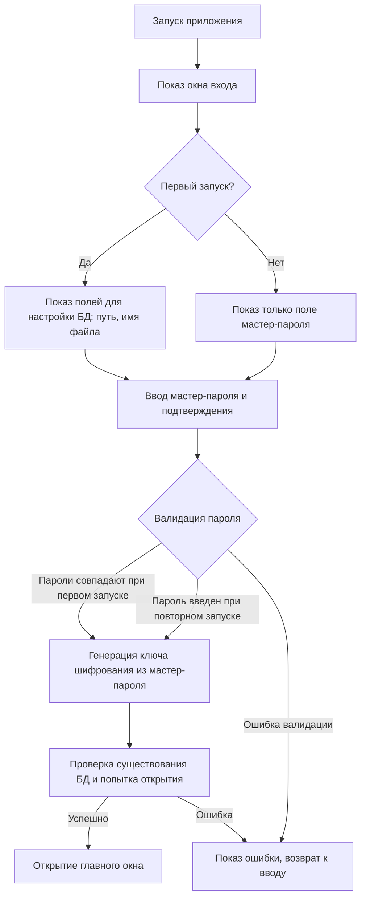
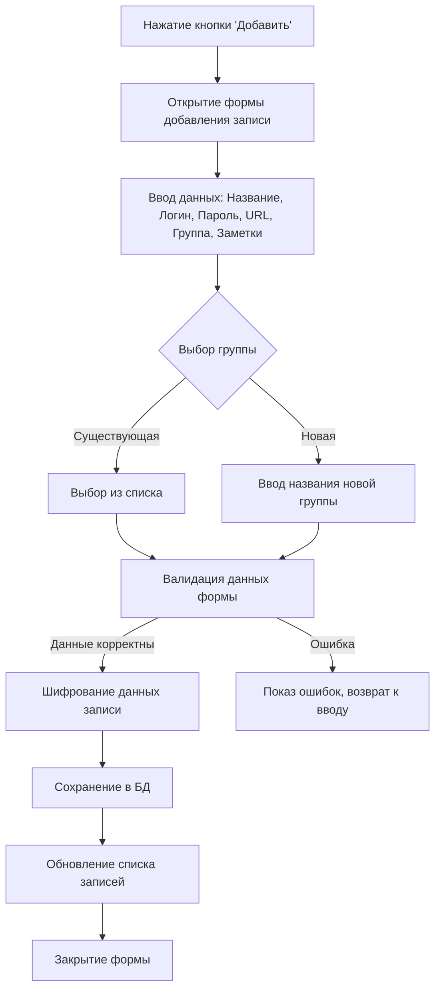
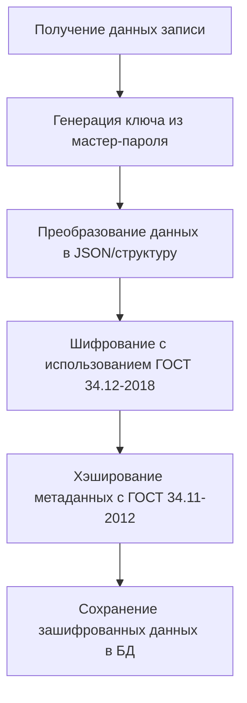
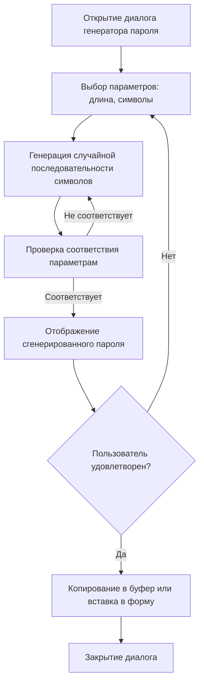
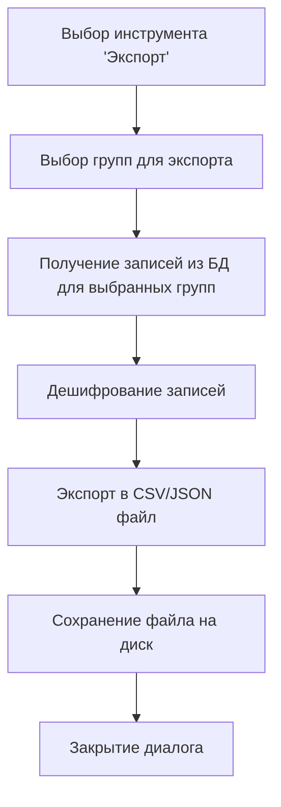
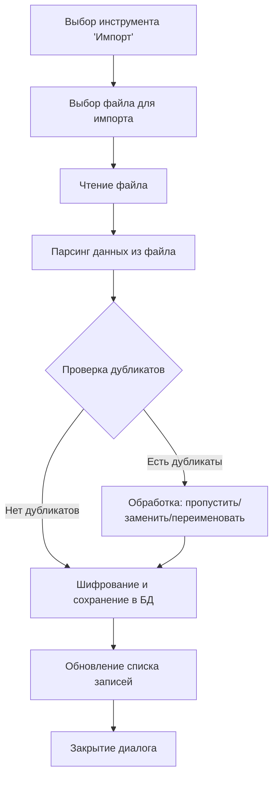
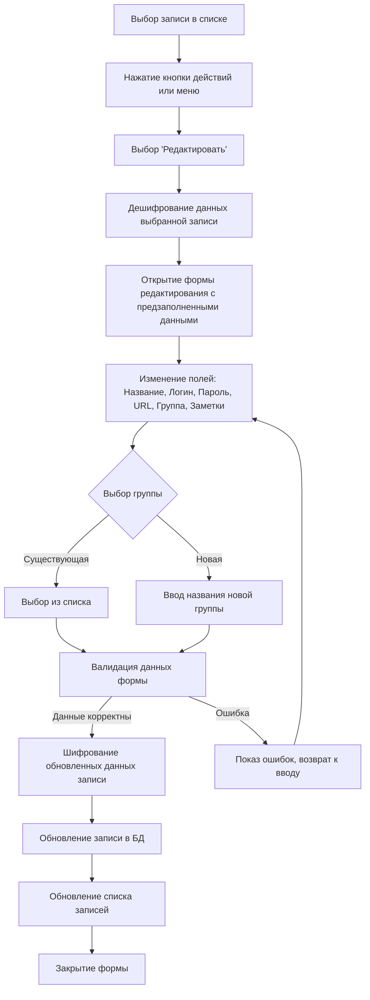
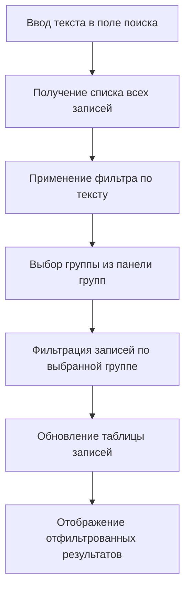
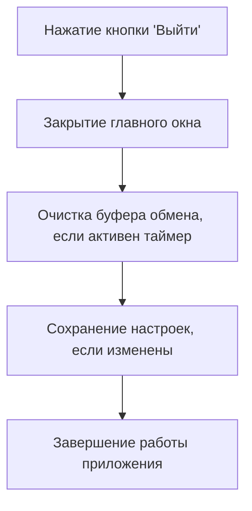

# Схема приложения PassLedger

## Общее описание
PassLedger — это кроссплатформенный менеджер паролей с графическим интерфейсом, разработанный на Go с использованием библиотеки Fyne. Приложение предоставляет безопасное хранение паролей в зашифрованной SQLite-базе данных, защищенной мастер-паролем.

## Архитектура приложения

### Основные компоненты
- **Входная точка**: `main.go` — инициализация приложения и запуск окна входа
- **Графический интерфейс**: Пакет `app/` — окна, формы и диалоги
- **Шифрование**: Пакет `crypto/` — криптографические функции (ГОСТ 34.12-2018, ГОСТ 34.11-2012)
- **База данных**: Пакет `db/` — взаимодействие с SQLite
- **Модели данных**: Пакет `models/` — структуры данных

## Схема пользовательского интерфейса

### 1. Окно входа (Login Window)
**Назначение**: Аутентификация пользователя мастер-паролем и настройка базы данных при первом запуске.

**Элементы интерфейса**:
```
+---------------------------+
| Password Book — Вход      |
+---------------------------+
| Введите мастер-пароль     |
| [Пароль]                  |
|                           |
| Повторите мастер-пароль  |  <- Только при первом запуске
| [Подтверждение]           |
|                           |
| ⚠️ Внимание! ...          |  <- Только при первом запуске
|                           |
| Выберите папку БД:        |  <- Только при первом запуске
| [Обзор...] [data]         |
|                           |
| Имя файла БД:             |  <- Только при первом запуске
| [passwords.db]            |
|                           |
| [Статус сообщений]        |
|                           |
|           [Войти]         |
+---------------------------+
```

**Логика**:
- При первом запуске: Показывает дополнительные поля для выбора пути к БД
- При последующих запусках: Только поле пароля
- Валидация: Проверка совпадения паролей при создании

### 2. Главное окно (Main Window)
**Назначение**: Основной интерфейс для управления паролями.

**Общая структура**:
```
+---------------------------------------------+
|                Toolbar                      |
+---------------------------------------------+
| Группы          | Записи          | Детали |
|                 |                 |        |
| + Добавить      | Title Username  | [Текст |
| группа          | URL   Group Act |  запи- |
|                 |                 |  си]   |
| Группа 1        |                 |        |
| Группа 2        |                 |        |
| ...             |                 |        |
+-----------------+-----------------+--------+
```

#### 2.1 Toolbar (Панель инструментов)
```
[Добавить] [Поиск: ________] [Фильтры ▼] [Инструменты ▼] [Настройки] [Выйти]
```

**Кнопки и функции**:
- **Добавить**: Открывает форму добавления новой записи
- **Поиск**: Поле для фильтрации записей по тексту
- **Фильтры**: Диалог настройки фильтров поиска (Title, Username, URL)
- **Инструменты**: Выпадающий список:
  - Генератор пароля
  - Экспорт
  - Импорт
- **Настройки**: Открывает окно настроек
- **Выйти**: Закрытие приложения

#### 2.2 Панель групп (Левая сторона)
```
Группы:
+ Добавить группу

[Все записи]     [✏️] [🗑️]
Группа 1         [✏️] [🗑️]
Группа 2         [✏️] [🗑️]
...
```

**Функции**:
- Выбор группы для фильтрации записей
- Добавление новой группы
- Переименование группы (кнопка ✏️)
- Удаление группы (кнопка 🗑️)
- Группа "Все записи" не может быть удалена

#### 2.3 Панель записей (Верхняя правая часть)
**Таблица с колонками**:
| № | Title | Username | URL | Group | Actions |
|---|-------|----------|-----|-------|---------|
| 1 | Site1 | user1    | url1| Group1| ⚙️      |
| 2 | Site2 | user2    | url2| Group2| ⚙️      |

**Функции**:
- Выбор записи для просмотра деталей
- Кнопка Actions: Открывает меню (Редактировать/Удалить)

#### 2.4 Панель деталей (Нижняя правая часть)
```
[Детали выбранной записи в формате Markdown]

[Скопировать пароль] [Таймер: 00:00] [Прогресс-бар]
```

**Функции**:
- Отображение полной информации о записи
- Копирование пароля в буфер обмена
- Автоматическая очистка буфера через заданное время

## Диалоги и формы

### 3. Форма добавления/редактирования записи
```
Добавить учётную запись
+---------------------------+
| Название:  [___________]  |
| Логин:     [___________]  |
| Пароль:    [***********]  |
| URL:       [___________]  |
| Группа:    [Выбрать ▼]    |
| Или новая:[___________]  |
| Заметки:   [           ]  |
|           [           ]  |
|           [Сохранить] [Отмена]
+---------------------------+
```

### 4. Диалог добавления группы
```
Добавить группу
+-------------------+
| Название: [____]  |
|                   |
|     [Создать] [Отмена]
+-------------------+
```

### 5. Диалог переименования группы
```
Переименовать группу
+-------------------+
| Название: [____]  |
|                   |
|     [Сохранить] [Отмена]
+-------------------+
```

### 6. Окно настроек
```
Настройки
+-----------------------------+
| Путь к БД*:                 |
| [Выбрать файл] [Создать]    |
| [data/passwords.db]         |
|                             |
| Тема: [Светлая] [Темная]    |
|                             |
| Таймер очистки буфера:      |
| [Слайдер: 1-60 сек]        |
|                             |
| * - изменения после перезапуска
|                             |
| [Применить] [Сохранить] [Отмена]
+-----------------------------+
```

## Инструменты

### Генератор пароля
- Диалог генерации случайных паролей
- Настраиваемые параметры (длина, символы)

### Экспорт
- Экспорт записей в файл (CSV/JSON)
- Выбор групп для экспорта

### Импорт
- Импорт записей из файла (CSV/JSON)
- Обработка дубликатов

## Поток работы пользователя

1. **Запуск приложения** → Окно входа
2. **Аутентификация** → Главное окно
3. **Управление записями**:
   - Добавление новых записей
   - Организация по группам
   - Поиск и фильтрация
   - Просмотр и копирование паролей
4. **Настройки** → Изменение параметров приложения
5. **Выход** → Закрытие приложения

## Безопасность
- Все данные шифруются с использованием ГОСТ стандартов
- Мастер-пароль для генерации ключа шифрования
- Автоматическая очистка буфера обмена
- Локальное хранение базы данных

## Алгоритмы приложения

### 1. Вход в приложение



### 2. Создание записи



### 3. Шифрование записи



### 4. Работа генератора пароля



### 5. Экспорт записей



### 6. Импорт записей



### 7. Редактирование записи



### 8. Фильтрация



Фильтрация работает в два этапа: по тексту и по группе.

1. **Поиск по тексту**: Пользователь вводит текст в поле поиска. Приложение ищет совпадения в полях Название (Title), Логин (Username) и URL всех записей. Записи, содержащие введенный текст в этих полях, остаются видимыми.

2. **Фильтрация по группе**: Пользователь выбирает группу в левой панели. Если выбрана конкретная группа, показываются только записи из этой группы. Если выбрана "Все записи", фильтр по группе не применяется.

Результаты фильтрации отображаются в таблице записей в реальном времени по мере ввода текста или выбора группы.

### 9. Выход из приложения


